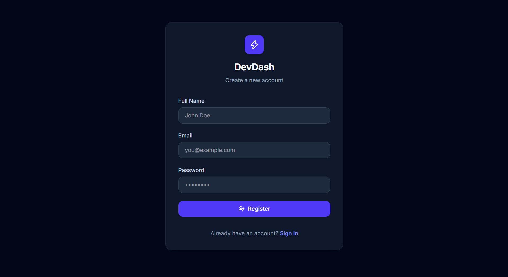
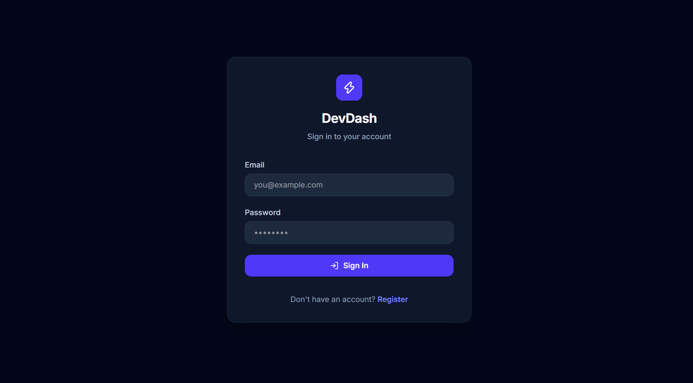
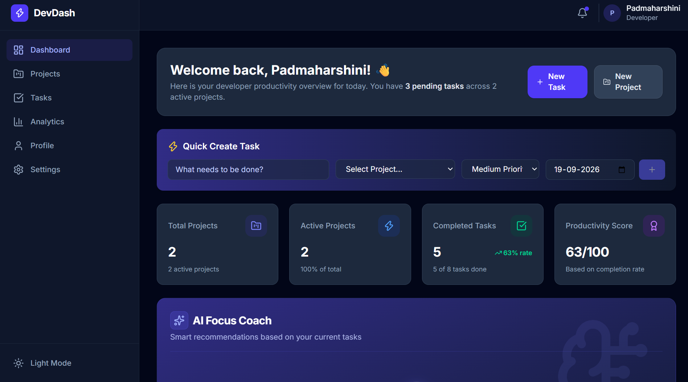
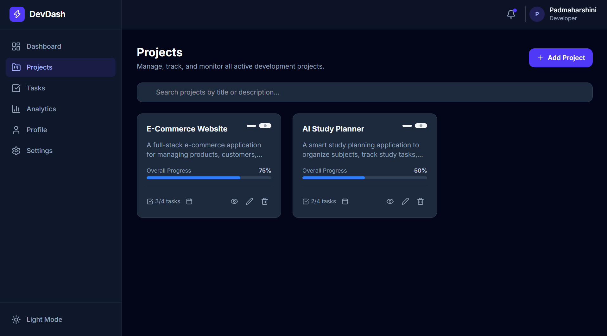
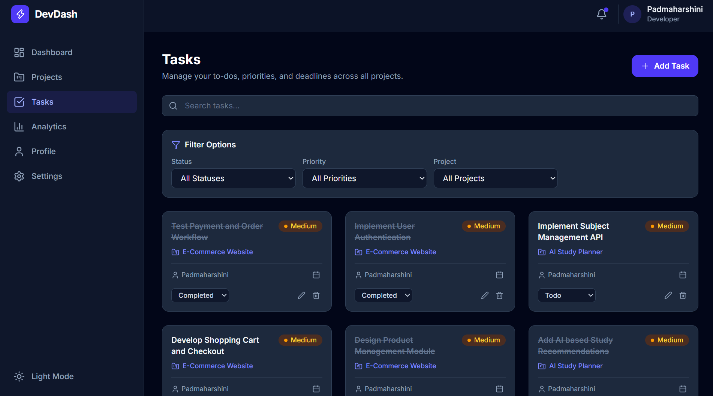
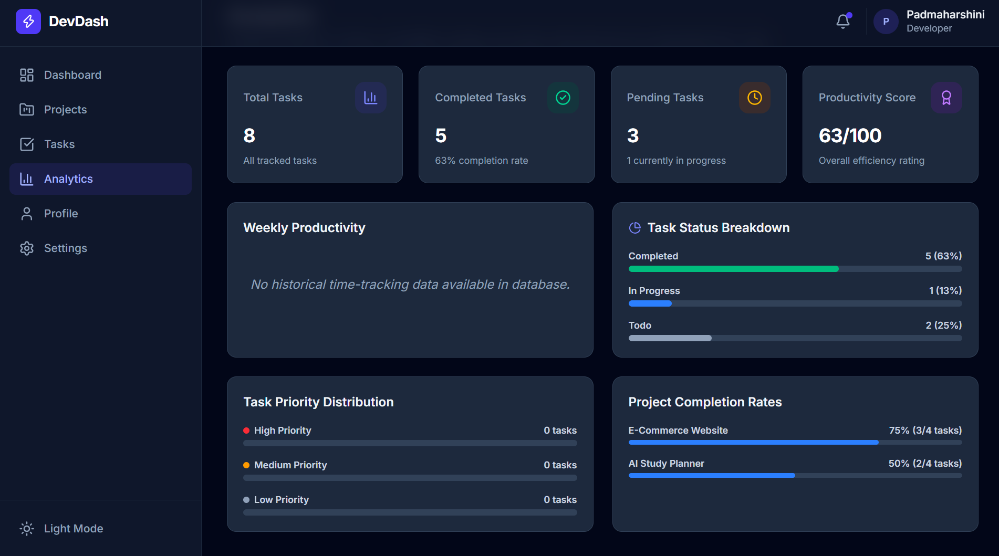
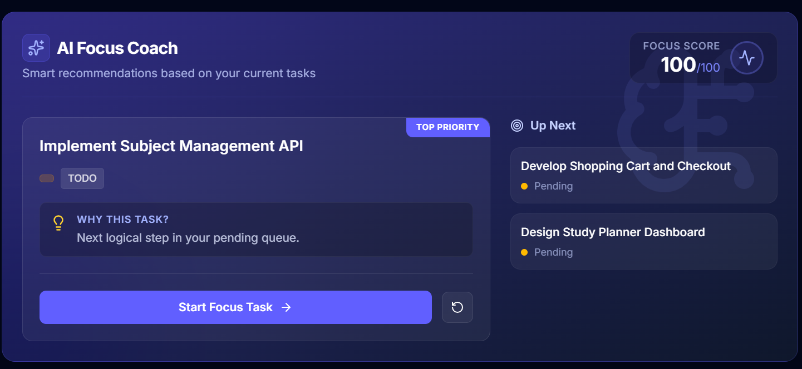
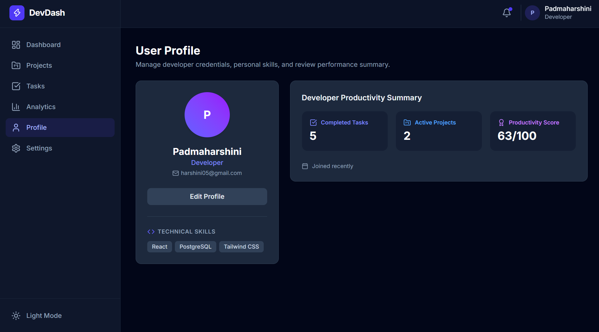
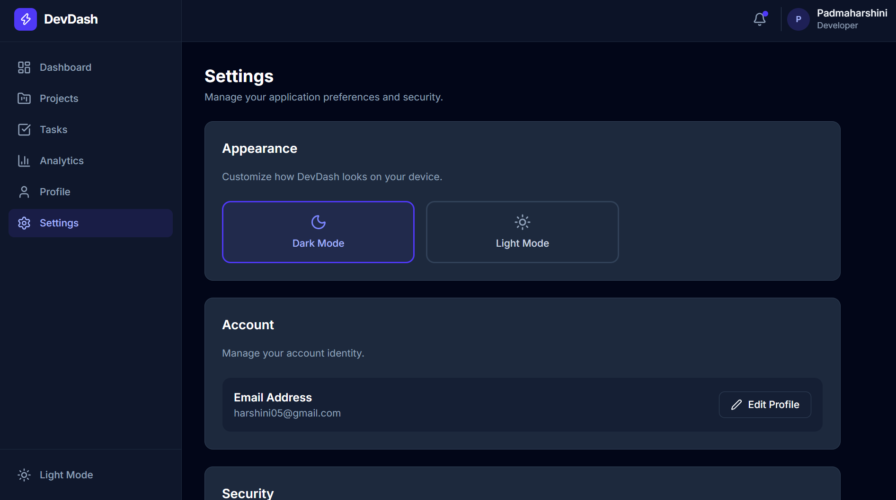

# 🚀 DevDash — Developer Productivity Dashboard

A full-stack developer productivity dashboard designed to help developers manage projects, organize tasks, track progress, monitor productivity, and receive intelligent task prioritization insights through a modern and responsive interface.

Developed as part of the **Innovation Hacks Full-Stack Development Internship — Task 4**.

---

## 📌 Overview

**DevDash** is a full-stack web application that provides a centralized workspace for managing projects and tasks.

The application combines a modern React frontend with a Node.js and Express.js backend, PostgreSQL database integration, JWT-based authentication, and an intelligent **AI Focus Coach** feature.

The project demonstrates practical implementation of:

- Full-stack web development
- RESTful API development
- PostgreSQL database integration
- Authentication and authorization
- CRUD operations
- Frontend-backend integration
- Project and task management
- Productivity analytics
- Intelligent task prioritization
- Responsive UI design

---

## ✨ Features

### 🔐 Authentication

- User registration
- User login
- JWT-based authentication
- Protected routes
- Secure password hashing using bcrypt
- Persistent authentication state
- Logout functionality

### 📊 Dashboard

- Overview of projects and tasks
- Project progress tracking
- Task statistics
- Completed and pending task information
- Productivity overview
- Recent activity
- Quick task creation
- Intelligent task prioritization insights

### 📁 Project Management

- Create projects
- View projects
- Edit projects
- Delete projects
- Project progress tracking
- Project-based task organization

### ✅ Task Management

- Create tasks
- View tasks
- Edit tasks
- Delete tasks
- Update task status
- Set task priority
- Assign tasks
- Set due dates
- Search tasks
- Filter tasks
- Track pending and completed tasks

### 📈 Analytics

- Task completion statistics
- Task status distribution
- Task priority distribution
- Project progress
- Productivity insights
- Visual analytics

### 🤖 AI Focus Coach

The application includes an **AI Focus Coach** feature that analyzes available task information and provides intelligent prioritization suggestions.

It helps users identify tasks that require attention based on factors such as:

- Task priority
- Task status
- Due dates
- Pending tasks
- Overdue tasks

The feature helps users focus on important and time-sensitive tasks.

### 👤 Profile

- View profile information
- Edit profile details
- Manage user information

### ⚙️ Settings

- Application preferences
- Light and dark theme support
- Theme persistence
- Password management
- Logout functionality

---

## 🛠️ Tech Stack

### Frontend

- React.js
- Vite
- React Router
- Axios
- Tailwind CSS
- Lucide React

### Backend

- Node.js
- Express.js
- RESTful APIs
- JWT
- bcryptjs

### Database

- PostgreSQL

### Development & Testing Tools

- Git
- GitHub
- Postman
- pgAdmin
- VS Code

---

## 🏗️ Application Architecture

```text
                    ┌─────────────────────┐
                    │      React UI       │
                    │   Vite + Tailwind   │
                    └──────────┬──────────┘
                               │
                               │ Axios / REST API
                               ▼
                    ┌─────────────────────┐
                    │   Express.js API    │
                    │      Node.js        │
                    └──────────┬──────────┘
                               │
                    ┌──────────┴──────────┐
                    │                     │
                    ▼                     ▼
             JWT Authentication     Controllers
                    │                     │
                    └──────────┬──────────┘
                               │
                               ▼
                    ┌─────────────────────┐
                    │     PostgreSQL      │
                    │      Database       │
                    └─────────────────────┘
```

---

## 📂 Project Structure

```text
developer-productivity-dashboard-task4/
│
├── frontend/
│   ├── src/
│   │   ├── components/
│   │   ├── context/
│   │   ├── pages/
│   │   ├── services/
│   │   ├── utils/
│   │   └── App.jsx
│   │
│   ├── public/
│   ├── index.html
│   ├── package.json
│   └── vite.config.js
│
├── config/
├── controllers/
├── middleware/
├── routes/
├── sql/
│
├── screenshots/
│   ├── login.png
│   ├── register.png
│   ├── dashboard.png
│   ├── projects.png
│   ├── tasks.png
│   ├── analytics.png
│   ├── profile.png
│   ├── settings.png
│   └── AI_focus_coach.png
│
├── index.js
├── package.json
├── .env.example
├── .gitignore
└── README.md
```

---

## 🗄️ Database

The application uses **PostgreSQL** for persistent data storage.

### Main Entities

```text
Users
  │
  ├───────────────┐
  │               │
  ▼               ▼
Projects         Tasks
  │               ▲
  │               │
  └───────────────┘
```

### Relationships

- One user can have multiple projects.
- One user can have multiple tasks.
- One project can contain multiple tasks.
- Tasks can be assigned to users.
- Projects are associated with their respective users.
- Tasks are associated with projects.
- Foreign keys maintain relationships between entities.
- Deleting a project removes its associated tasks.

---

## 🔌 API Modules

| Module | Operations |
|---|---|
| Authentication | Register, Login |
| Users | Profile Management |
| Projects | Create, Read, Update, Delete |
| Tasks | Create, Read, Update, Delete |
| Analytics | Productivity and Task Statistics |

---

## 🔒 Security

Security considerations implemented in the application include:

- JWT-based authentication
- Protected API routes
- Password hashing using bcrypt
- Authorization middleware
- Environment variables for sensitive configuration
- Authentication before accessing protected resources
- No credentials committed to the repository

---

## 🔗 Frontend & Backend Integration

The React frontend communicates with the Express.js backend through REST APIs.

```text
React Frontend
      ↓
    Axios
      ↓
Express REST API
      ↓
Authentication Middleware
      ↓
   Controllers
      ↓
  PostgreSQL
```

Protected requests use JWT authentication through the Authorization header.

---

# 📸 Screenshots

## 🔐 Login

The login interface allows registered users to securely access the application.



---

## 📝 Register

New users can create an account through the registration interface.



---

## 🏠 Dashboard

The dashboard provides an overview of projects, tasks, progress, productivity information, and recent activity.



---

## 📁 Projects

The Projects section allows users to create, manage, update, and track their projects.



---

## ✅ Tasks

The Tasks section provides task management with status, priority, assignee, due date, search, and filtering capabilities.



---

## 📊 Analytics

The Analytics section provides visual insights into task progress, completion, priorities, and productivity.



---

## 🤖 AI Focus Coach

The AI Focus Coach provides intelligent task prioritization insights to help users identify tasks that need attention.



---

## 👤 Profile

The Profile section allows users to view and manage their profile information.



---

## ⚙️ Settings

The Settings section provides application preferences including theme and account-related settings.



---

# ⚙️ Getting Started

## Prerequisites

Make sure the following software is installed:

- Node.js
- npm
- PostgreSQL
- Git

---

## 📥 Clone the Repository

```bash
git clone <YOUR_GITHUB_REPOSITORY_URL>
cd developer-productivity-dashboard-task4
```

---

# 🔧 Backend Setup

Install backend dependencies:

```bash
npm install
```

Create a `.env` file in the backend root directory:

```env
PORT=3000
DATABASE_URL=your_postgresql_connection_string
JWT_SECRET=your_secure_jwt_secret
```

Start the backend:

```bash
npm run dev
```

The backend runs on:

```text
http://localhost:3000
```

---

# 💻 Frontend Setup

Open a new terminal:

```bash
cd frontend
npm install
npm run dev
```

The frontend runs on:

```text
http://localhost:5173
```

---

# 🧪 API Testing

The backend REST APIs were tested using **Postman**.

Testing included:

- User registration
- User login
- Project creation
- Project retrieval
- Project updates
- Project deletion
- Task creation
- Task retrieval
- Task updates
- Task deletion
- Authentication validation
- Protected route validation
- Request validation
- Error handling

---

# 📌 Key Learning Outcomes

Through this project, I gained practical experience in:

- Building full-stack web applications
- Developing RESTful APIs
- React component development
- React routing and state management
- PostgreSQL database integration
- CRUD operations
- JWT authentication
- Password hashing
- Protected API routes
- Frontend and backend integration
- API testing using Postman
- Debugging application issues
- Git and GitHub workflow
- Responsive UI development
- Productivity analytics
- Intelligent task prioritization

---

# 🎯 Project Goals

The main goals of DevDash are to:

- Provide a centralized productivity workspace
- Simplify project and task management
- Help users track project progress
- Improve task organization
- Provide productivity insights
- Help users prioritize important tasks

---

# 🚀 Future Enhancements

Possible future improvements include:

- Real-time notifications
- Team collaboration
- Advanced productivity reports
- Calendar integration
- Email notifications
- Real-time task updates
- Cloud deployment
- Advanced AI productivity recommendations
- Team-based project management

---

# 🎥 Project Demo

A complete demonstration of the application is available through the project demo video.

**Demo Video:**  
[Watch the DevDash Demo](https://drive.google.com/file/d/1fXdNJTDQLTurnqUpCyzeNaMnl4xQpckH/view?usp=sharing)

---

# 💼 Internship

## Innovation Hacks — Full-Stack Development Internship

This project was developed as **Task 4** of the Innovation Hacks Full-Stack Development Internship.

The internship provided hands-on experience in:

- Frontend development
- Backend development
- REST API development
- Database integration
- Authentication
- Application testing
- Debugging
- Full-stack application architecture

---

# 🙏 Acknowledgement

A sincere thanks to **Innovation Hacks** for providing this valuable internship opportunity and hands-on experience in full-stack development.

Special thanks to the mentors and team for their guidance, support, and feedback throughout the internship.

---

# 📄 License

This project was developed for educational and internship purposes.